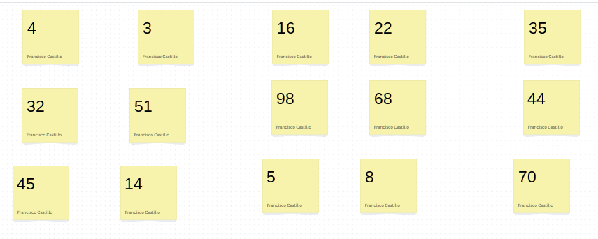
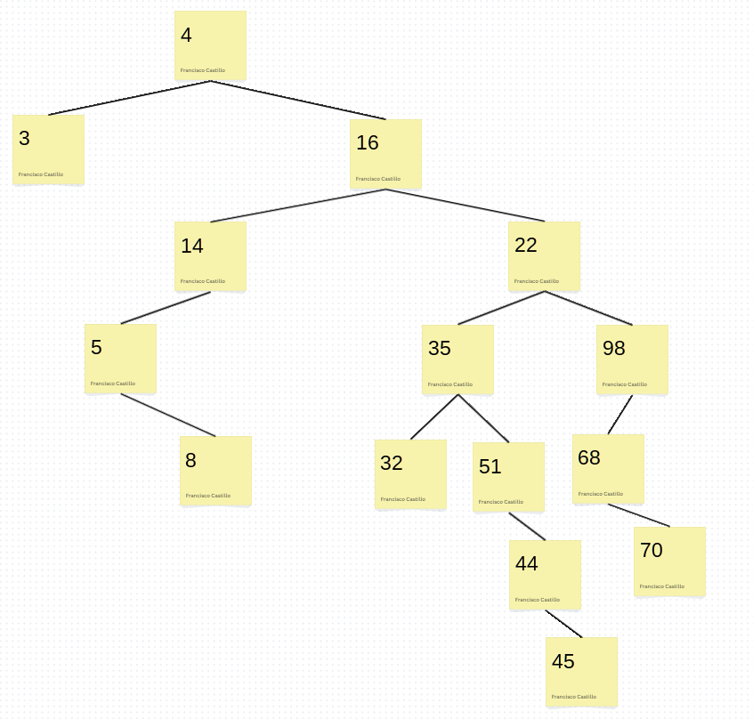
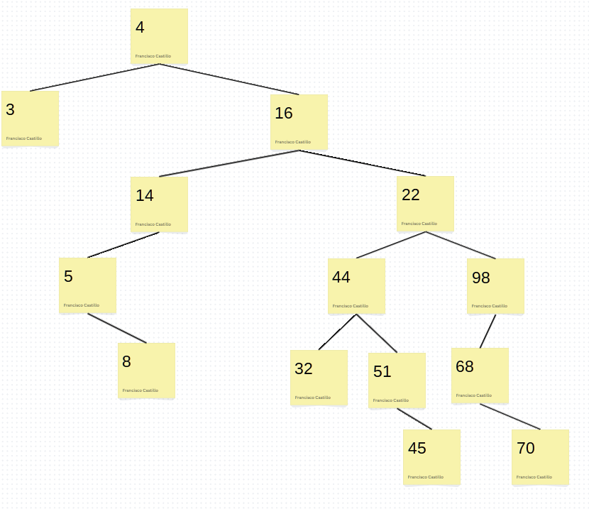
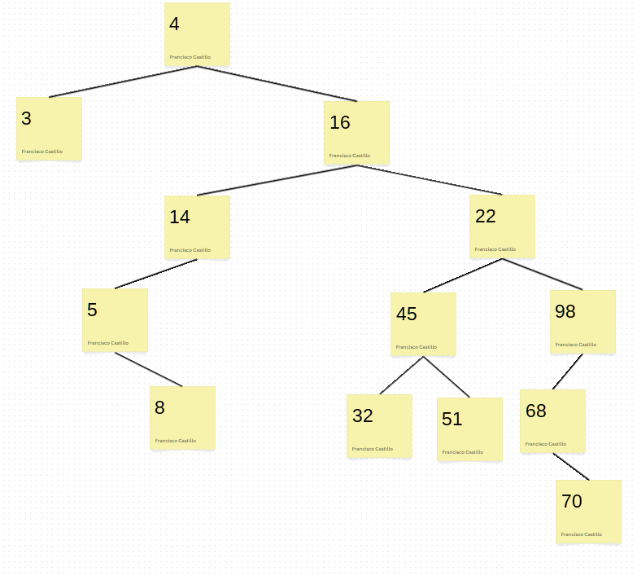
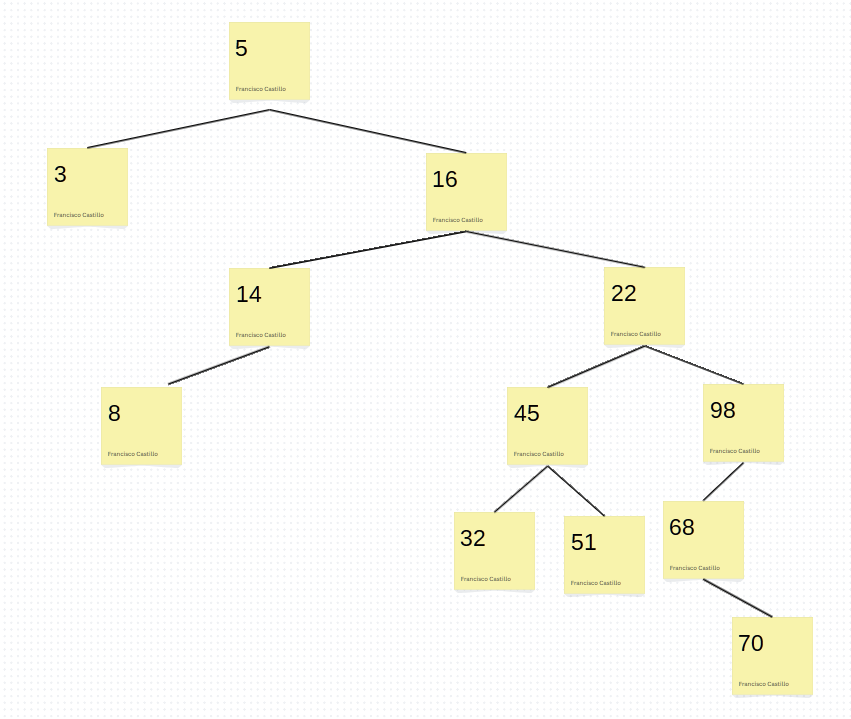
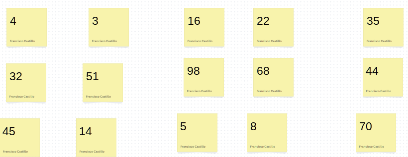
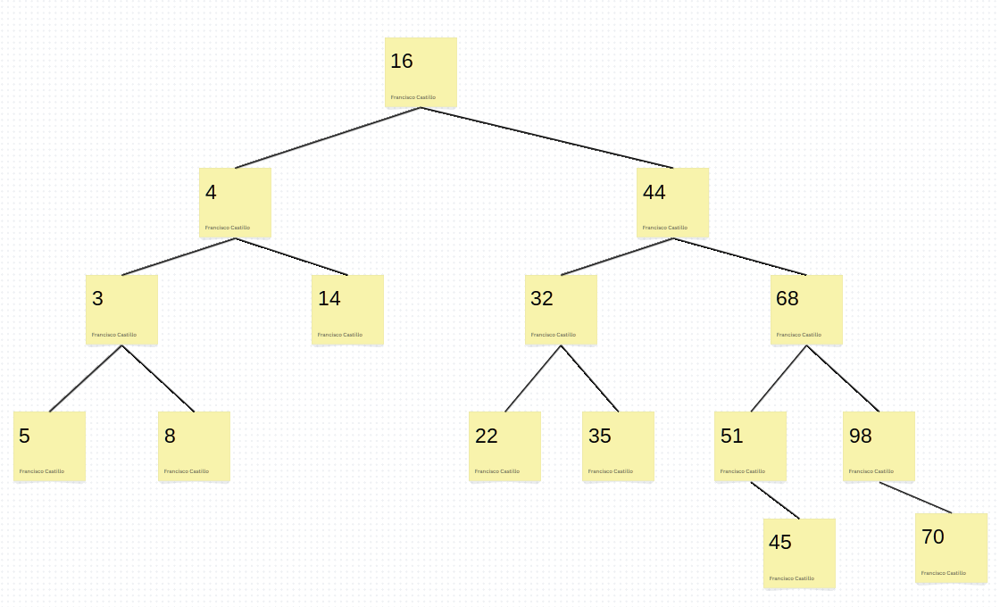
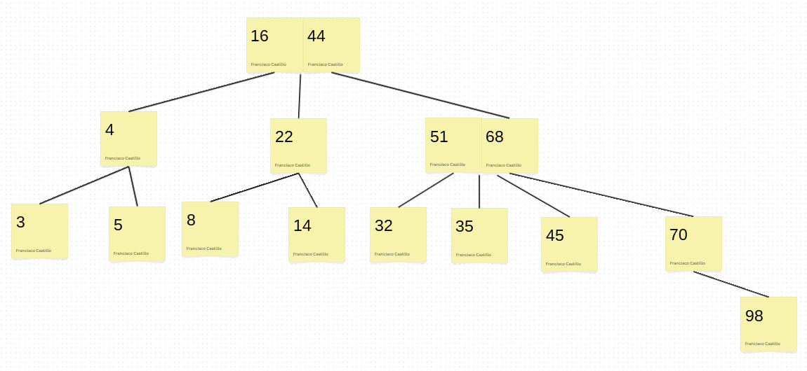

# Lab 7

* Francisco Castillo

## Part A: BST Insert

As a group review bst insertion algorithm.

* Take one photo of the original row of sticky notes

* When completed, take one photo of the final tree

Answer this question.

* What is the height of your final tree?

The final height is 6, because we count the edges from the root to the farthest point (45). In this case the edges are  (4, 16), (16, 22), (22, 35), (35, 51), (51, 44).

## PART B: BST Deletion

* Find a node in your tree with 2 children and remove that node.
	* Take a picture of tree

	The node to delete is 35, this is the final result:

* find another node with 2 children and remove that node
	* Take picture of tree

44 deleted:

* remove the root node of the tree
	* take picture of tree

Answer this question:

* Anytime you remove a node with 2 children, you need to find a node to take over for node being removed.  Explain how you found your replacement.

BST has an order, and when we remove one node we need to keep that order, which means that all the values in left subtree are smaller than the node value, and all the values to the right subtree are larger than the node value. 
Whe we remove a node we need to go for the successor, which is the smallest value in the right subtree. There is another way, that is find the predecessor of the node, which is the largest calue in the left subtree. The main idea is guarantee the order property will be preserve no matter wich option we choose, after remove the node.

## Part C AVL

* Take one photo of the original row of sticky notes

* When completed, take one photo of the final tree

Answer these questions. 
* How many times you had to do a single rotation?
I had to do a single rotation 3 times

* How many times you had to do a double rotation?
I had to do a double rotation 1 time

* How tall is your final tree?
The height of the final tree is 4

## Part D Red-black trees (optional)

* Take one photo of the original row of sticky notes

* When completed, take one photo of the final tree

* how many times did you perform a colour swap, zig-zig and zig-zag rotation?

## Part E 2-3 trees

* Take one photo of the original row of sticky notes

* When completed, take one photo of the final tree

* How many times did you split?
6 times

## Part F Dijkstra's Algorithm

Use Dijkstra's algorithm to find the shortest distance from vertex A to every other vertex.  Show your work by creating the table below:

| Vertex | Distance to A | Previous Vertex | Known|
|---|---|---|---|
| A  |  0 | -  |  False |
| B  |  5 | -  |  True |
| C  |  9 | B  |  True |
| D  |  11 | C  |  True |
| E  |  10 | F  |  True |
| F  |  3 | -  |  True |
| G  |  12 | D  |  True |

Result summary: Fill in the final result in this table.  For path list all nodes for example, if you are going from A to B to C to D, then path is A-B-C-D

| Vertex | Path | Distance to A|
|---|---|---|
| A  |  - | 0 |
| B  |  A-B | 5 |
| C  |  A-B-C | 9 |
| D  |  A-B-C-D | 11 |
| E  |  A-F-E | 10 |
| F  |  A-F | 3 |
| G  |  A-B-C-D-G | 12 |

## Part G: Reflection

This last part is to be completed individually.

In this lab, I have gained valuable insights into the creation of various types of trees including BSTs, AVL trees, and 2-3 trees. However, the most significant takeaway has been learning the intricacies of inserting and deleting nodes within these trees. This experience has provided me with a deep understanding of how each type of tree functions and how modifications to individual nodes can ripple through the entire structure, influencing its overall behavior. The trickiest part was wrapping my head around 2-3 trees, especially knowing when to split them.

